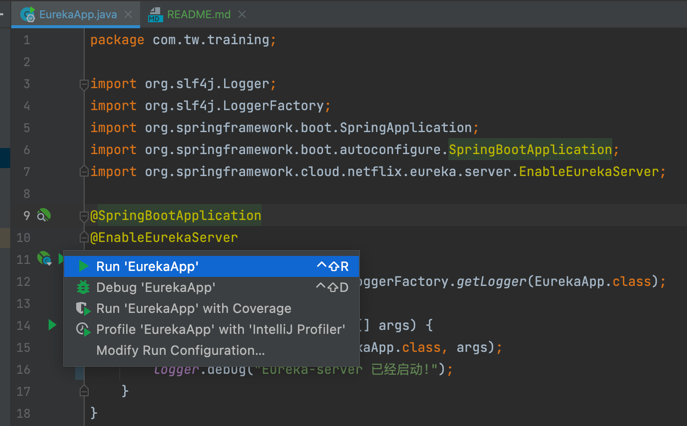
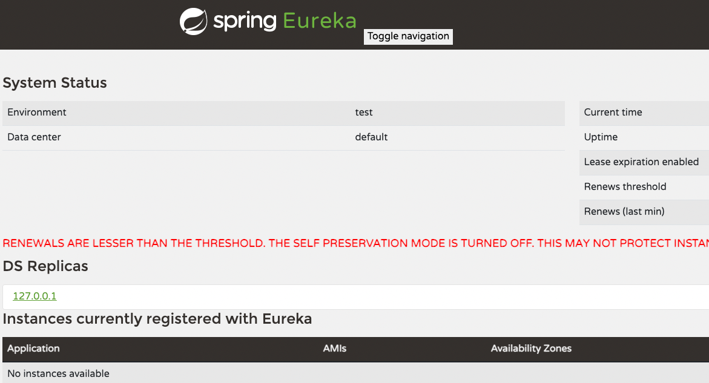

# Getting started
## Environment
* java 11
* maven 3.6
## Run with IDE
if you have setup your local env, you can directly run the app with IDE


## Run with Maven

 ``` shell
mvn clean package spring-boot:run
 ```

## Using docker
 ``` shell
docker-compose up eureka-server
 ```
After start the app you can access at: http://localhost:8761/


build image
 ``` shell
 docker build -t eureka-server:1.0.0 .
 ```